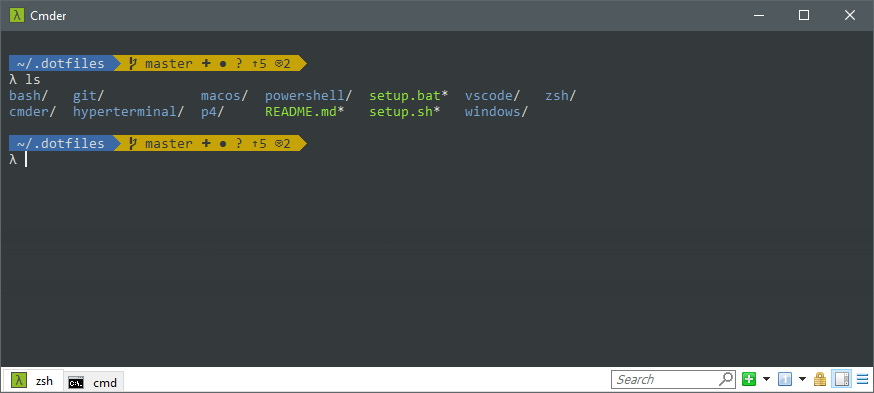

# Anthony Brien's .dotfiles

This repo contains my favorite developer settings for my Windows and MacOS machines. It contains a setup script for both platforms, that installs applications and sets up symlinks from their OS locations to these settings files. This repo should be stored under my home directory in `~/.dotfiles/`.



## Features

### On MacOS
- Sets up my favorite apps through Homebrew
- Sets up **iTerm2** and **Terminal.app** to use `zsh` and `oh-my-zsh`
- Set up a few [MacOS defaults](macos/set-defaults.sh)
- [Install script](setup.sh)

### On Windows
- Sets up Cmder to use zsh (through Cygwin)
- Sets up p4 settings
- [Install script](setup.bat)

### On Both MacOS and Windows
- [Git aliases](git/.gitconfig)
- [zsh aliases](zsh/.zshrc)
- Sets up **VS Code** settings
- Custom prompt using Powerline to show Git status

## Installation

```sh
$ git clone https://github.com/anthony-brien/.dotfiles.git ~/.dotfiles
$ cd ~/.dotfiles
$ chmod +x setup.sh
$ ./setup.sh
```
